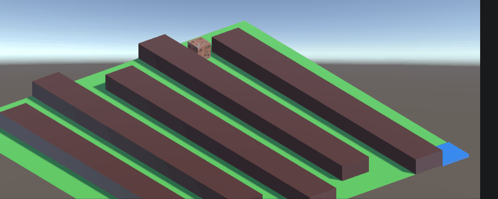
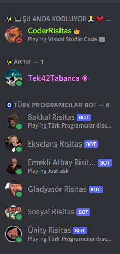

# Türk Programcılar Bot
Türk Programcılar Discord sunucusu tarafından geliştirilen bot

`Özellikler: (liste tam değildir)`
- Mega emoji kolezyum
- WebSockets sunucusu ile kanal yayını ( ~~şu an için geliştirilmesi devam etmiyor~~ __20.07.2021: destek geldi güncel olarak çalışıyor__)
- Exp sistemi
- Nvidia
- Unity emoji oyunu

`Environment variable` tanımlamaları
```
DCBOT_JSON             discord bot tokenların modüllere ayrıldığı JSON yapısı (örnek aşağıdadır)
DCBOT_PHPHOST          exp php host sunucu adı (örn: google.com formatında, http/s ve www koymayın)
DCBOT_DEBUG            Status mesajını farklı gösterir ve kolezyum kanalı olarak test kanalını kullanır (tanımlı olması yeter)
DCBOT_NOKOLEZYUM          Emoji bulunan mesajlarda kolezyumda otomatik mega yaratma 
                       özelliğin kapatır (tanımlı olması yeter)
DCBOT_PREFIX           komut öntakısı (bulunmazsa % varsayılan)
DCBOT_WEBSERVER        true, false: true ise WS özelliğini çalıştırır
DCBOT_WSPORT           WS portu (bulunmazsa varsayılan 3000)
WEB_UNITY              Unity WebGL oyunun bulunduğu dizin (default yapılması gereken tanımlama: webserver\\unity)
```
`tanımlı olması yeter` ifadesi geçen değerlerin tanımlı olması yeterlidir.
Değeri önemsizdir. 1 yazabilirsiniz illaki değer tanımlamanız gerekiyorsa. 
Tanımladığınız herhangi rastgele değer ihmal edilecektir.

`JSON token örneği`
```json
{
    "ODUxMD23ODMzNOD8MzM4NzUy.YL2hxw.U9iB6Sk5XSwpgHvqKQP9Cfl4Ryg": ["ataturk","kolezyum"],
}
```
Yukarıda örneği verilen token karşısında bulunan 2 modül aynı bot içerisinde çalıştırılır.
```json
{
    "ODUxMD23ODMzNOD8MzM4NzUy.YL2hxw.4pDP6SkxQShBgHvqKQP9Cfl4Ryg": ["ataturk"],
    "ODUxMD23ODMzNOD8MzM4NzUy.YL2hxw.oVDhBnPxTLqYZh81KIwvZybDQy4": ["kolezyum"],
}
```
Yukarıda örneği verilen farkli tokenlar karşısında bulunan modüler ayrı botlar içerisinde çalıştırılır.

# Geliştirici notları

Türk Programcılar discord sunucusu bot yazılımı zaman içerisinde ihtiyaçlar doğrultusunda eklemeler yapılarak geliştirilmiş, her bir eklemede farklı bir sistem ve mekanik içine dahil ederken eskiye dönük olarak diğer tüm modüllerine destek vermiştir.

Modüllere ayrılmış bir mimari üzerine `TypeScript` dil uzantısı desteği alarak daha temiz ve güvenli bir kod pratiği oluşturulmuş ve son olarak `Discord.js v13` güncellemesini de bünyesine kattıktan sonra daha modern, klasörlerle izole bir modül mimarisine geçmiştir.

## Çoklu mimari yapısı
Mimari yapısının karmaşıklığı aynı anda farklı zamanlarda oluşturulmuş olan modül mimarisine halen desteği sürdürmeye çalışmasından gelmektedir. Bunu kabaca kronolojik bir sırayla örneklendirmek gerekirse şu şekilde birkaç modül örnek verilebilir.

### Atatürk.js (legacy js)
Modül çok sade, tek görevi olan bir modüldür. Sadece init edildikten sonra mesaj ve emoji reaksiyon dinlemesi yapar. Bu bir `legacy js` diyebileceğimiz miras kalmış olan eski bir modüldür. `exports.init` ve `exports.on_event` gibi yapıları vardır. Bu kategoride daha karmaşık modül örneği olarak `bakkal.js` verilebilir. Bu `legacy js` kategorisinde ve init exports gibi yapıları olmasına rağmen çok daha karmaşık görevleri olan bir modüldür.

### Nvidia.ts (legacy ts)
Bu modülün de tek bir görevi vardır ve jsden `TypeScript` geçişi sırasında varolan `JavaScript` mimarisini bire bir kopyalamıştır. Bu arafta kalmış bir mimari denilebilir. `TypeScript` geçişi sonrası daha doğru bir mimari sonra oturtulmuştur. Bu modüllerin yüklenmesi kendi mimarileri farklı olmasına rağmen yine de sonraki `TypeScript` mimarileri ile aynı mantıkta yüklenmektedir.

### Boilerplate.ts (legacy ts)
Bu modül `boilerplate` denilen başlangıçta modül oluştururken kullanılan bir iskelet dosyasıdır. Basit bir ping pong örneği. Bu `TypeScript` ile varılmak istenen mimari için oluşturulmuş bir modüldür. `v13`e kadar son mimari yapısını temsil etmiştir. Bu kategoride `coderstatus.ts` modülü bir başka örnek olarak gösterilebilir.

### modern_boilerplate (modern ts)
Bu mimari `v13` için yeni geliştirilmiş ve özellikle `command` yapısına destek sağlamak amacıyla klasör altında modül geliştirme imkanı sunmuştur. Modül klasörü altında bir `main.ts` dosyası bulunur ve bu dosya tamamen `legacy ts` mimarisini kullanarak modülün diğer tüm fonksiyonalitesini sağlarken aynı zamanda `support_commands` bayrağı modül tanıma sistemi tarafından otomatik kaldırıldığından dolayı içerisinde bulunan commands klasöründeki tüm komut dosyalarını tarayarak haznesine kayıt eder ve işletilmesini sağlar. Bu iskelet yapısında örnek olarak `/ping` komutu işlenmiştir.

### Özel amaç için geliştirilmiş diğer mimariler
Türk programcılar discord sunucusu botun herhangi bir genel modül yapısına uymayan özel gereksinimlerden doğmuş bir kaç mimarisi daha bulunmaktadır. Bunlardan birine örnek `WebSocket` ve `HTTP` protokollerini kullanarak sunucu içerisinden bir websitesine yayın yapmayı imkan kılan `wschannel.js` modülü verilebilir.

Bir diğer örnek olarak ise `Unity3d` oyun motorunda geliştirilmiş olan `WebGL` oyunumuz ile `emojitower.ts` modülü birleşiminden oluşan, sunucu içerisinde gönderilen mesajlardaki sunucumuza özel emojileri tarayarak oyun içerisindeki labirentte çıkartan sistem mimarisi örnek verilebilir.

## Çalışma prensibi
`main.js` dosyasi belirtilen `token` ve `modül` sözlüğünü işleyerek gerekli botları teker teker ayağa kaldırır. 

Her bir can bulan bot soluğunu `bot.js` dosyasında alır. Burada bir botun birden fazla modül sorumluluğu olabileceğinden sorumluluk alanındaki modüller dosya sisteminde taranarak öncelikle hangi mimaride olduğuna karar verilir. 

An itibariyle üç farklı mimariden birinin belirlenmesiyle her bir mimarinin özel yükleme yönetime göre botun sorumluluk alanındaki modüller birer birer yüklenir ve gereken `event` kayıt işlemlerini discord `client` üzerinde yapılır. 

### legacy js mimarisi
Kabaca `require` yapılır ve modül içerisinde dışarı aktarılması beklenen `exports.init` ve `exports.on_event` yapıları üzerinden hareket edilir.

### legacy ts mimarisi
`TypeScript` dosyaları derlenmiş olduğundan dolayı farklı bir dizine `JavaScript` dosyaları çıkarılır. `Build` klasörü altında doğru tanımlama yapılarak `require` yapılır ve modül içerisinden devam edilir. Bu kategorinin önceden de belirtildiği gibi iki alt kategorisi vardır. Birincisi arafta kalmış olan `js-ts` mimarisi ve ikincisi ise modüler `ts` mimarisi. `js-ts` mimarisi `Build` klasörü altında ilgili dosya bulunduktan sonra yaklaşık olarak eski `legacy js` mimarisine benzemektedir. `ts` modüler mimari ise `module.ts` adında bir sınıf tanımlamasından kalıtım almış modülleri içeren mimaridir ve varolan `legacy js` mimarisinin üzerine kılıf geçirilerek `TypeScript` dilinin `type-safety` özelliğinden faydalanılmıştır. Daha nesne yönelimli bir yapısı bulunmaktadır.

### modern ts klasör mimarisi
Yükleme işlemi `legacy-ts` mimarisinde olduğu gibi `Build` klasörü altında yapılır. Burada her bir modül kendi klasörü altında daha düzenli bir yapıda tutulur. Her modülün kendine has bir `main.ts` dosyası ve `commands` klasörü gibi yapı taşları bulunmaktadır.

# Modül dizini
(Liste tam değildir)
- [Bakkal Risitas](#Bakkal-Risitas)
- [Gladyatör Risitas](#Gladyatör-Risitas)
- [Ünity Risitas](#Ünity-Risitas)
- [Şu anda kodluyor](#Şu-anda-kodluyor)

### Bakkal Risitas
```diff
+ Bakkal risitas bot hakkında bilgilendirme ve yardım menüsü
```
`Botun amacı`
Bakkal risitas botunun temeldeki amacı sunucu içerisinde knight online oyunundan esinlenerek geliştirilen eşya sisteminin takibi ve oyuncunun eşyaları ile ilgili düzenleme veya yükseltme yapabileceği işlevleri sağlamaktır. 

`Çalışma prensibi`
Bot sadece #bot-komutlaru kanalında çalışmaktadır ve sadece aşağıdaki komutları kabul etmektedir.

`Eşya kazanmak`
Eşya kazanmak veya kasmak bu botun kapsamında olmasa da eşya ile ilgili yerlere değindiği için nasıl olduğunu burada bahsetmekte fayda var. Şu an için bilinen eşya kazanma yöntemleri aşağıda belirtilmiştir:
```css
1. Disboard patlatmasi yaparak Ekselans Risitas tarafından ödüllendirilmek 
2. Kolezyum'da MEGA emoji keserek ilk üç'e girerek Gladyatör Risitas tarafından ödüllendirilmek
```

`Eşya yükseltmek`
Eşya yükseltmek eşyanızın güçlerini yükseltir. Eşya yükseltmek için `%yukselt` komutunu kullanınız. Bot sizi yönlendirecektir.

`Anektar kırdırmak`
Anektara şeklindeki tüm itemlar kırdırılıp onun yerine rastgele başka bir item kazanılmaktadır. Bunun nasıl yapılacağı hakkında üstteki yardım menüsünde açıklama yapılmıştır.

`Yardım menüsü`
```ini
;; ;; ;; ;; Temel profil komutları ;; ;; ;; ;;

%profil    [ tüm profili ve güçleri gosterir ]

%profil X  [ X'deki itemi gosterir ]

%envanter  [ yazı olarak eşyaları gösterir ]

;; Diğer kullanım şekilleri
%profil @mention 
%profil @mention X

;; ;; ;; ;; Eşya yönetimi ;; ;; ;; ;;

%soyun     [ itemlerin hepsini çıkarır ]
%cikart X  [ X'deki itemi çıkartır ]
%giy X     [ X'deki itemi giyer ]

%sil X     [ X'deki itemi siler (önerilmez şu an item tutma sınırı yok)]


;; ;; ;; ;; Özel komutlar ;; ;; ;; ;;

%anektar X [ X'deki anektari kırdırır ]

%seviyeler [ Tüm seviyeleri ve exp kademelerini gösterir ]
;;
```

### Gladyatör Risitas
```diff
+ Gladyatör risitas bot hakkında bilgilendirme ve kolezyum kanalı
```
`Botun amacı`
Gladyatör risitas botunun temeldeki amacı sunucuda mesaj içerisinde emoji takibi yaparak emoji kullanmanız durumunda belirli bir şans ile (%1) #kolezyum kanalında `MEGA EMOJİ` çıkartmak ve takibini yapmaktır. 

`Çalışma prensibi`
Bot sadece #kolezyum kanalında komut takibi yapmaktadır ve sadece bir komutu vardır oda `vur` komutu. Başında % olmadan yazmanız gerekiyor.

`Hasar sistemi`
Sunucudaki tüm botlarımız birbiriyle entegre çalışmaktadır. Dolayısı ile @Gladyatör Risitas#3864 botu hem @Ekselans Risitas#2592 ile haberleşerek sizin `deneyim` bilginizi alır hemde @Bakkal Risitas#8407 ile haberleşerek profil bilginizi elde eder. Bunun sonucunda @Bakkal Risitas#8407'da da görebileceğiniz profilinizdeki hasar değerlerine ulaşır. 

`Örnek hasar hesaplaması`
Herkesin temelde `100` hasar puanı vardır. Üzerindeki `Item`ler ile bunu daha fazla kuvvetlendirebilirsiniz. Mesela `500` hasar puanını örnek alalım. Sonra sizin bir önceki `vur` komutu üzerinden geçen zamana oranla bir değer ile çarpılır. Bu kısaca spamı önlemek içindir. Yani çok hızlı `vur vur` spam yaparsanız hasarınız çok düşük olacaktır. Aşağıda sizin için görebileceğiniz optimal değerler verilmiştir.
```
Geçen zaman | çarpan | 500 üzerinden final hasar değeri
0.5 saniye    0.08     40
  2 saniye    0.50     250
  5 saniye    1        500
 20 saniye    1.5      750
 30 saniye    ~2       1000                        
```
Çok fazla beklemek 2 katın üzerine çıkmanızı sağlamayacaktır. En optimal saldırı önerisi 3 ile 5 saniye arasındadır. Bütün hasar grafiğini incelemek isterseniz link aşağıdadır:
https://tinyurl.com/34uy2w5y

`Yardım menüsü`
```ini
vur [Başında % olmadan yazmanız gerekiyor.]
;;
```

### Ünity Risitas
```diff
+ Ünity Risitas bot hakkında bilgilendirme ve yaptığımız Ünity oyunu
```
`Botun amacı`
Ünity Risitas botunun temeldeki amacı sunucu içerisinde gönderilen mesajları tarayarak içerisinde sunucu emojisi bulunup bulunmadığını tespit etmektir. Tespit edilen emojilerin http linkleri oluşturularak Ünity webgl sitesindeki oyun tarafına gönderilir.

`Çalışma prensibi`
Tüm sunucu kanallarında çalışmaktadır. Bot, kullanıcı ile dolaysız olarak direkt etkileşim yapmaz veya herhangi bir komut kabul etmez.

`Ünity Oyunu`
Tarayıcınızda adresi açın ve sunucu içerisinde herhangi bir yere emoji gönderin. Mesajınızın içerisinde bulunan tüm emojiler sırayla çıkacaktır. Başkasının emojileri de çıkabilir. Sıraya girer hepsi.

https://unity-ogreniyoruz-tp-ailesi.herokuapp.com/
```ini
[mouse sol tuş] duvar örer tekrar basma siler
[mouse sağ tuş] hedef ekler [shift]e basili tutunca çıkış noktası ekler tekrar basma siler
[G] ızgara gizle göster
[V] yapay zekanın alacağı yolu gösterir gizler```
spam test için #tpbot-test-odası veya #tpbot-test-odası2 kanallarını
kullanabilirsiniz.
```



### Şu anda kodluyor
```diff
+ SUNUCUMUZDA KODLAMA YAPAN ARKADASLAR ANLIK OLARAK ARTIK EN USTTE GORUNECEKTIR VE ACIK YESIL RENKLI OLACAKTIR. SIZLERI ARAMIZDA GORMEKTEN COK MUTLUYUZ. BOL VE KEYIFLI KODLAMALAR DILERIZ EFENDIM.
```
`Desteklenen uygulamalar`
```ini
[VSCode]
extension yuklenmesi gerek
; https://marketplace.visualstudio.com/items?itemName=icrawl.discord-vscode

[Visual Studio 2019]
extension yuklenmesi gerek
; [15:23] MrCHUCK: discord diye aratin discord rich bilmem ne diye cikiyor

[pycharm 2021]
plugin yuklenmesi gerek
; https://plugins.jetbrains.com/plugin/10233-discord-integration

[Sublime text]
yardımınıza ihtiyacı var. ; eklenmesi için aşağıda yapmanız gerekenler anlatılmıştır.

[Vim]
yardımınıza ihtiyacı var. ; eklenmesi için aşağıda yapmanız gerekenler anlatılmıştır.

```

`Yeni uygulamalar için destek`
Gelecekte uygulama listesini genişletmek istiyoruz. Bunun için yardımınıza ve önerilerinize ihtiyacımız var.


`Ekran görüntüsü:`


# Türk Programcılar Discord Sunucusu

Türk Programcılar discord sunucusu programlamaya yeni başlayan ve her seviyeden insanlara yardım etmeyi hedefleyen bireylerin toplantığı bir platformdur. Birbirimizi motive ettiğimiz, her gün yeni birşeyler öğrenmeye teşvik ettiğimiz sunucumuzda; kodlama yarışmaları ve eğlenceli birçok diğer aktiviteleri de keşvedebilirsin.

Hemen aramıza katıl!

[https://disboard.org/server/698972054740795453](https://disboard.org/server/698972054740795453)

Şu an sunucudaki bulunan ve her gün genişleyen kanal listemiz: Assembly, C, C++, C#, Dart, Go, Haskell, Java, JavaScript, EcmaScript, Kotlin, Lua, Perl, Python, Ruby, Rust, Sql, Mssql, Mysql, TypeScript, VBNET, Flutter, NodeJs, ReactJs, Angular, AspNet, Bootstrap, Django, Html CSS, Mean, MongoDb, ExpessJs, Laravel, Php, Ruby on Rails, Scss, Sass, Stylus...


